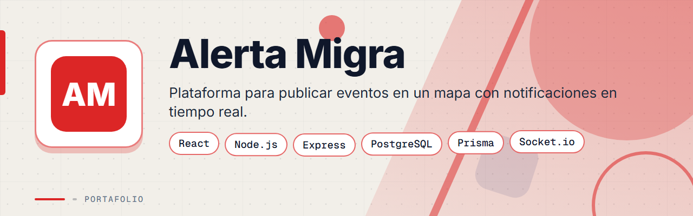
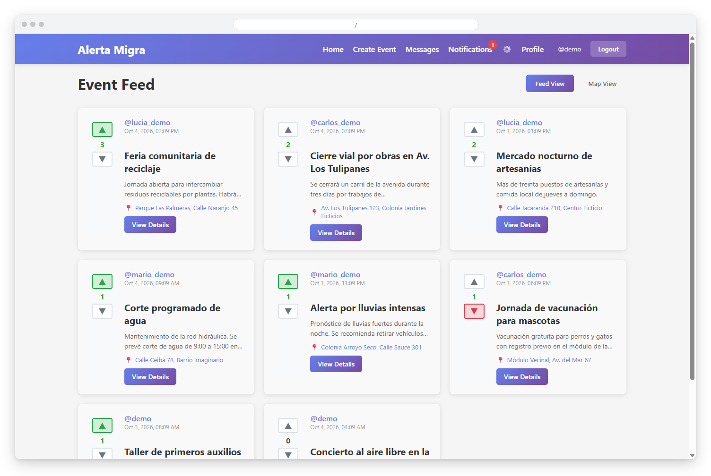
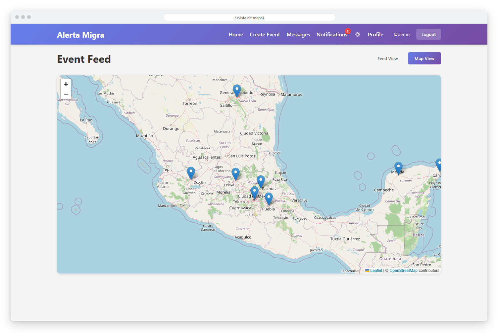
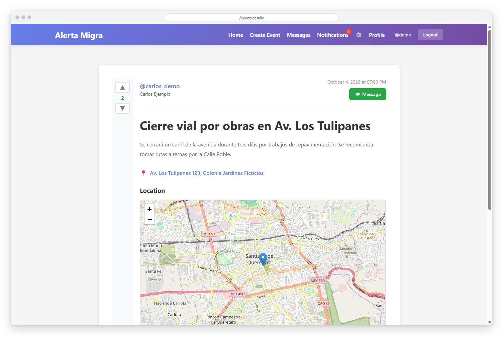
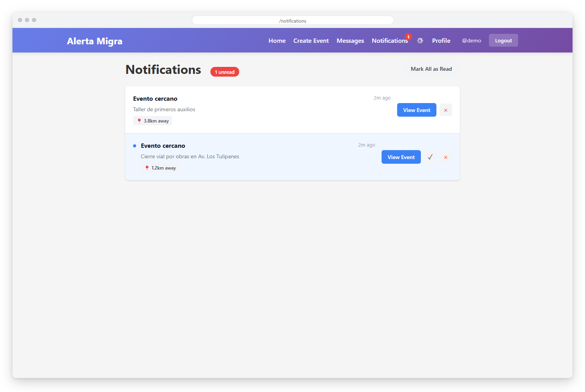
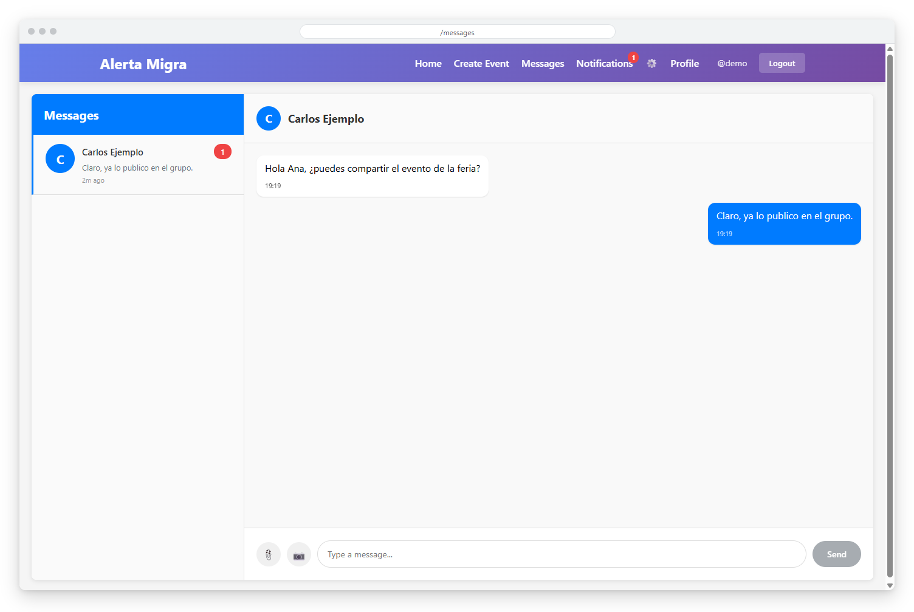
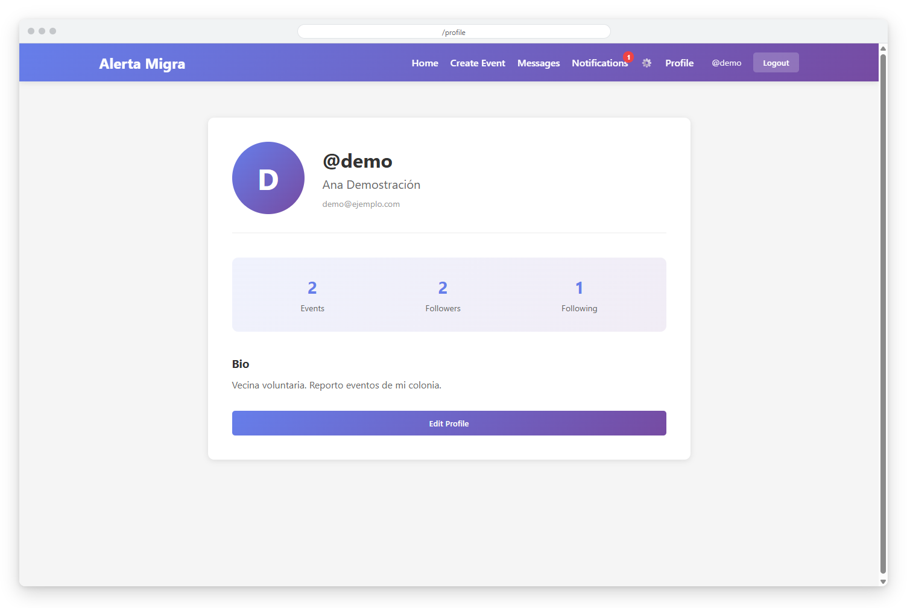
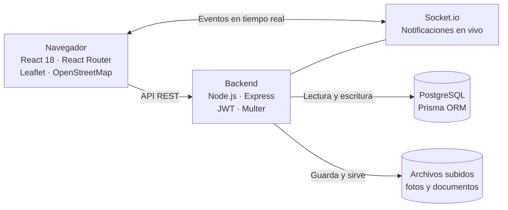

<div align="center">



# Alerta Migra


**Plataforma web para crear y compartir eventos con ubicación en un mapa, votos, comentarios, mensajes entre usuarios y notificaciones en tiempo real de lo que ocurre cerca de ti.**

</div>

> Este es un **portafolio showcase**: el código fuente es propietario y no está incluido. Todos los datos de las capturas son ficticios.

---

## Contenido

- [El Problema](#el-problema)
- [La Solución](#la-solución)
- [Funcionalidades](#funcionalidades)
- [Vista Previa](#vista-previa)
- [Arquitectura](#arquitectura)
- [Stack Tecnológico](#stack-tecnológico)
- [Instalación local](#instalación-local)
- [Roadmap](#roadmap)
- [Contacto](#contacto)

---

## El Problema

Las comunidades comparten avisos locales por chats y redes dispersas, y la información se pierde o llega tarde:

- No hay un lugar único donde ver qué ocurre y dónde.
- Los avisos no se pueden filtrar por cercanía.
- Es difícil saber qué información es útil para otros: falta una forma de votarla y comentarla.
- Cada persona quiere enterarse solo de lo que pasa cerca de su ubicación.

---

## La Solución

Una aplicación full-stack con React y un backend Express sobre PostgreSQL. Cada evento se publica con su ubicación, fotos y descripción, y se puede ver como feed o sobre un mapa de OpenStreetMap con Leaflet. Los usuarios votan y comentan, se siguen entre sí, se escriben mensajes privados y reciben notificaciones en vivo con Socket.io cuando se crea un evento dentro del radio que configuraron.

---

## Funcionalidades

| Funcionalidad | Descripción |
|---------------|-------------|
| Registro e inicio de sesión | Autenticación con JWT y contraseñas cifradas con bcrypt |
| Eventos con ubicación | Creación de eventos con ubicación fijada en el mapa y subida de fotos y documentos |
| Feed y mapa | Dos vistas de los eventos: lista tipo feed y mapa interactivo con marcadores |
| Búsqueda por cercanía | Consulta de eventos cercanos a unas coordenadas dentro de un radio |
| Votos y comentarios | Votos a favor y en contra por evento y comentarios de los usuarios |
| Notificaciones en vivo | Avisos en tiempo real de eventos nuevos dentro del radio configurado, con la distancia |
| Mensajes privados | Conversaciones entre usuarios de la plataforma |
| Perfiles y seguidores | Perfil con biografía y estadísticas, seguir y dejar de seguir usuarios, y búsqueda de usuarios |

---

## Vista Previa



<table>
  <tr>
    <td width="50%">
      
      <br><b>Mapa</b>: eventos ubicados sobre un mapa interactivo con marcadores.
    </td>
    <td width="50%">
      
      <br><b>Detalle del evento</b>: descripción, autor, votos y ubicación en el mapa.
    </td>
  </tr>
  <tr>
    <td width="50%">
      
      <br><b>Notificaciones</b>: avisos de eventos cercanos con la distancia.
    </td>
    <td width="50%">
      
      <br><b>Mensajes</b>: conversaciones privadas entre usuarios de la plataforma.
    </td>
  </tr>
  <tr>
    <td width="50%">
      
      <br><b>Perfil</b>: datos del usuario, eventos, seguidores y biografía.
    </td>
    <td width="50%"></td>
  </tr>
</table>

---

## Arquitectura



**API REST:** rutas para autenticación, usuarios, eventos (incluida la búsqueda por cercanía), conexiones entre usuarios, votos, comentarios, mensajes y notificaciones. La distancia entre un evento y cada usuario se calcula con la fórmula de Haversine y se compara con el radio de su preferencia de notificación.

---

## Stack Tecnológico

| Capa | Tecnología |
|------|-----------|
| Frontend | React 18 · React Router · React Toastify |
| Mapas | Leaflet · React Leaflet · OpenStreetMap |
| Tiempo real | Socket.io |
| Backend | Node.js · Express · express-validator |
| Autenticación | JWT · bcryptjs |
| Archivos | Multer |
| Datos | PostgreSQL · Prisma ORM |
| Despliegue | Docker · Nginx |

---

## Instalación local

> **Aviso:** el código es privado y propietario. Estos pasos son solo para colaboradores autorizados con acceso al repositorio.

1. Instala Node.js, PostgreSQL y npm.
2. Instala las dependencias del backend y del cliente:
   ```bash
   npm install
   cd client && npm install
   ```
3. Copia `.env.example` a `.env` y completa tus propios valores.
4. Aplica las migraciones y genera el cliente de Prisma:
   ```bash
   npx prisma migrate dev
   npx prisma generate
   ```
5. Inicia el backend y el frontend a la vez:
   ```bash
   npm run dev
   ```

---

## Roadmap

- [ ] Notificaciones push en el navegador (la preferencia ya existe en el modelo de datos).
- [ ] Mejorar la barra de navegación en pantallas pequeñas.
- [ ] Moderación de eventos y reportes de contenido.

---

## Contacto

El código fuente es propietario. Para consultas o propuestas, escríbeme:

[](mailto:pablozam1931@gmail.com)
[%206517--1870-25D366?style=for-the-badge&logo=whatsapp&logoColor=white)](https://wa.me/50765171870)
[](https://github.com/deadlyrat)

- Correo: [pablozam1931@gmail.com](mailto:pablozam1931@gmail.com)
- WhatsApp: [(507) 6517-1870](https://wa.me/50765171870)
- GitHub: [github.com/deadlyrat](https://github.com/deadlyrat)

---

*Parte del portafolio de [deadlyrat](https://github.com/deadlyrat)*
